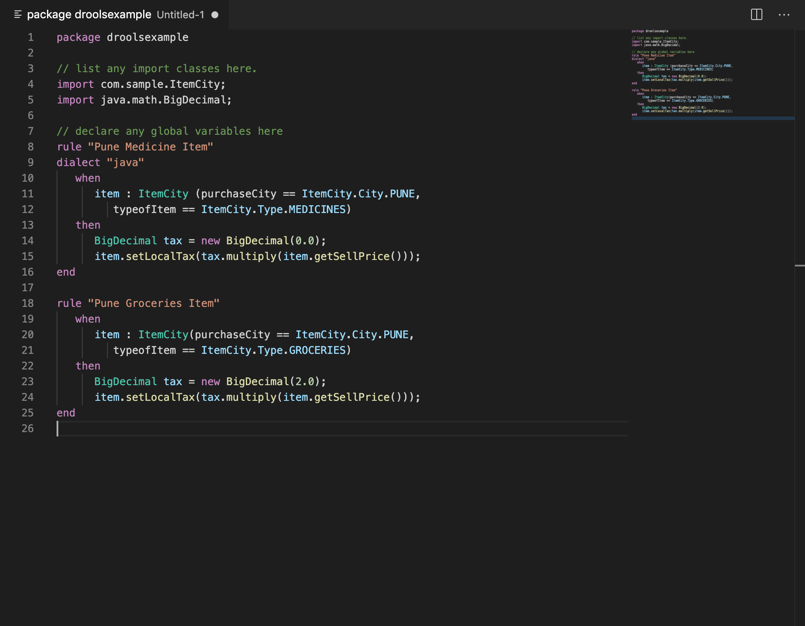

# Drools VS Code Extension

This extensions adds drools language support to vscode (.drl).

## Features

See image for example .drl syntax highlighting

## Release Notes

### 0.0.2

Reworked the highlighting to be mostly dependent on context

### 0.0.1

Initial Release, enjoy!
